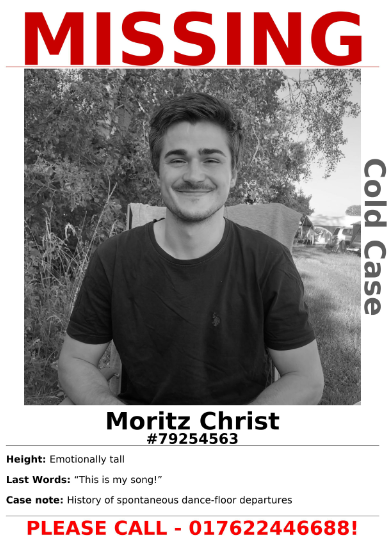

# Missing Poster Package

1. First command *create_csv* takes folder with images that are named after the person
2. Creates CSV file with those and funny attributes
3. Second command *csv_to_missing_poster* takes in csv file and creates pdf of Missing posters

### Example of PDF created
